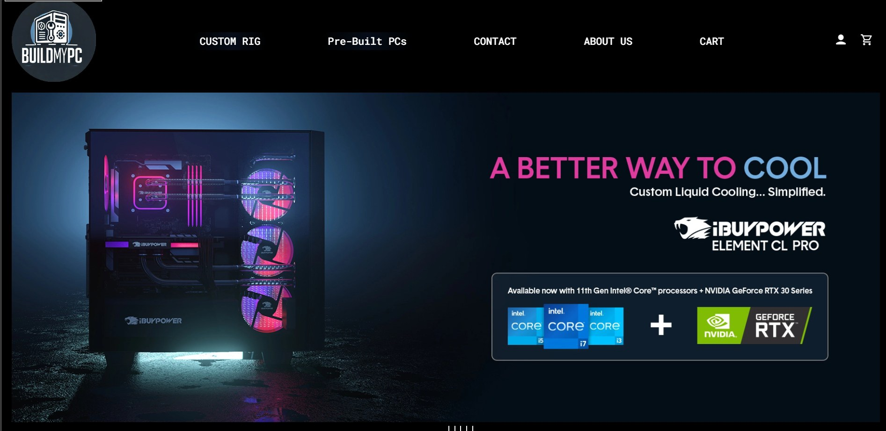
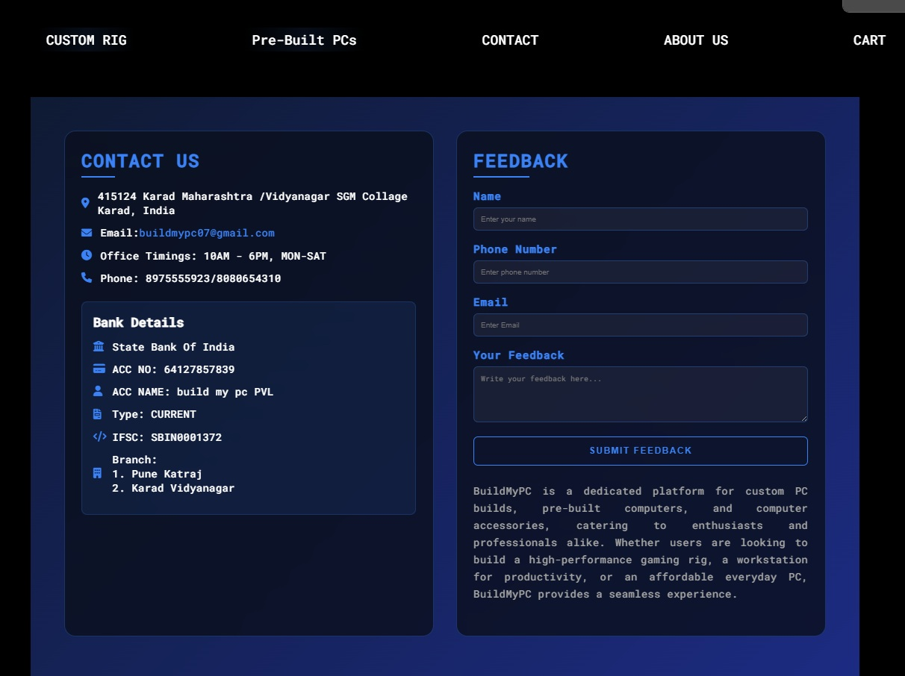
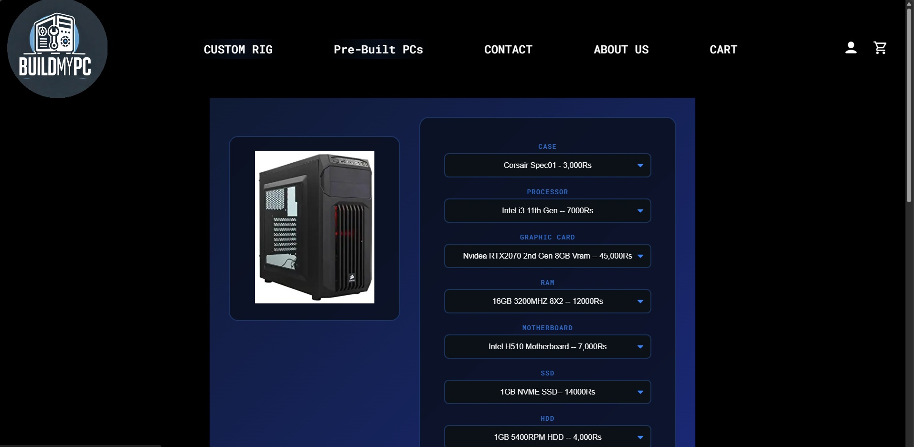
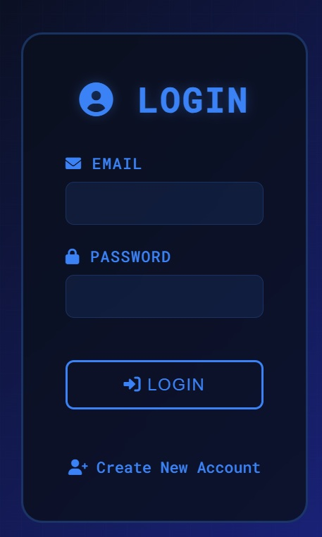

# 💻 BuildMyPc

**BuildMyPc** is a PC building website where users can enjoy a smooth and interactive experience in creating their dream custom PC setups by choosing compatible parts. The platform also offers pre-built systems, computer accessories, and rental services to meet different user needs—from casual users to professional creators.

This project demonstrates the core idea of giving users control over their builds, guiding them through an intuitive process backed by a clean UI, responsive design, and dynamic features. It is ideal for tech enthusiasts, gamers, students, and businesses looking for tailored computing solutions.

> **🔗 Live Demo:** [Click here to visit the live website](http://pcbuilding.42web.io/home.php)  
> **⚠️ Note:** This is a demo project developed for educational purposes.

---

## ✨ Key Features

- 🛠️ **Custom PC Builder** – Select individual components (CPU, GPU, RAM, etc.) to build your custom PC.
- 🖥️ **Pre-Built Systems** – Browse and explore a collection of ready-made PC configurations.
- 🎧 **Accessories Store** – Purchase essential add-ons and peripherals.
- 🧳 **Rentals Section** – Rent laptops or desktops for short- or long-term needs.
- 🔐 **User Authentication** – Login, registration, and secure session handling.
- 🧾 **Secure Password Handling** – Passwords are hashed and stored securely in the database.
- 🎨 **Modern UI** – Scrollable banners, hover animations, and a clean layout enhance user engagement.

---

## 🛠️ Technologies Used

- **Frontend:** HTML, CSS (with custom animations), JavaScript  
- **Backend:** PHP  
- **Database:** MySQL  
- **Security:** PHP `$_SESSION` variables, password hashing

---

## 📸 Screenshots & UI Previews

### 🏠 Home Page
  
  
> The homepage includes a smooth scrollable banner using checkboxes for animation effects.

---

### 🧩 Custom PC Builder
  
> Users can choose from a range of PC parts, each with prices, to build their ideal system.

---

### 🔐 Login System
  
> A simple login UI with session handling. Incorrect login shows a clean error prompt. Credentials are verified with hashed passwords stored in the database.

---

## 📂 Project Structure (Simplified)

```bash
/BuildMyPc
│
├── index.html / home.php       # Homepage
├── login.php                   # Login page
├── register.php                # Registration page
├── custom-pc.php               # PC builder logic
├── accessories.php             # Accessories catalog
├── rentals.php                 # Rentals section
├── terms.html                  # Terms & Conditions
├── css/style.css               # Styles and animations
├── images/                     # Banners and product images
└── db/db.sql                   # Database schema
```

---

## 🚀 How to Run Locally

1. Clone this repository:
   ```bash
   git clone https://github.com/yourusername/BuildMyPc.git
   ```
2. Set up a local server using XAMPP or WAMP.
3. Import `db.sql` into your local MySQL database.
4. Place the project folder in your `htdocs` directory and run via `localhost`.

---

## 📌 Future Enhancements

- Component compatibility checker
- Admin dashboard for managing users and products
- Payment gateway integration
- Dark mode and more themes


